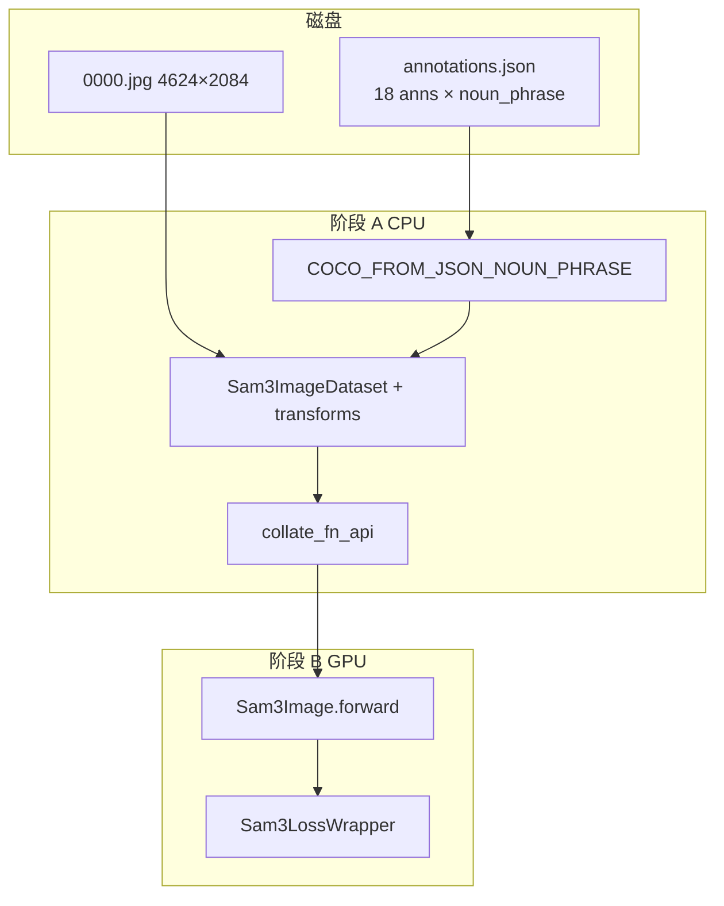

# exp-002 数据流学习文档 — 一个样本从原始数据到 loss

> **实验**：exp-002 · noun_phrase 自然语言指令微调  
> **目标**：读懂「一条 Qwen 描述 → 一个 mask」如何进入 SAM3 训练  
> **实测**：`python scripts/sft_dataflow_trace.py --run --config exp-002`（2026-06-11）  
> **学习版（推荐先读）**：[SFT_DATAFLOW_EXP002_LEARN.md](SFT_DATAFLOW_EXP002_LEARN.md) — 流程图 + Transform 链人话解释  
> **对比 exp-001**：[SFT_DATAFLOW_10MIN.md](SFT_DATAFLOW_10MIN.md)（query 恒为 `"object"`）

---

## 0. 与 exp-001 的核心区别（先建立对照）

| | exp-001 | **exp-002（本文）** |
|--|---------|---------------------|
| 训练文本 | `"object"`（类别名） | **`noun_phrase`**（Qwen 生成的完整句子） |
| 每条 query 监督几个 mask | 全图所有实例（~18 个） | **恰好 1 个** |
| 每图 query 数 | 1 | **~8–48**（avg ~20） |
| Loader | `COCO_FROM_JSON` | **`COCO_FROM_JSON_NOUN_PHRASE`** |
| 项目意图 | 跑通 pipeline 基线 | **对齐「懂自然语言再分割」** |

---

## 1. 符号表

| 符号 | 含义 |
|------|------|
| B_img | 图像 batch 大小（恒为 1） |
| Q | 单张图上的 find query 数（样本 0000 实测 **18**） |
| Q_txt | 去重后的文本数（实测 **11**，部分 noun_phrase 重复） |
| H, W | 输入分辨率 1008×1008 |
| N_q | 第 q 条 query 对应的 GT 数（exp-002 恒为 **1**） |

---

## 2. 最小样本（全文统一用这个例子）

```python
raw_sample = {
    "image": "datasets/raw_images_train/0000.jpg",
    "size": (4624, 2084),
    "annotations_in_json": 18,  # 该图在 JSON 中有 18 条标注
}
# 实测 transform 后保留 18 条 query（因 FilterEmptyTargets 可能略少）
# 示例 query 0:
query_0 = {
    "text": "A red SUV parked in front of a blue semi-trailer truck.",
    "gt_objects": 1,  # 只监督这一个 mask
}
```

**shape 数据来源**：`python scripts/sft_dataflow_trace.py --run --config exp-002`

---

## 3. 总览：两阶段 + 一张图

```
阶段 A（CPU）  磁盘 JSON / JPG  →  BatchedDatapoint
阶段 B（GPU）  model(batch)      →  core_loss 标量
```



---

# 阶段 A：数据预处理

## Step A1 — 磁盘上的原始数据

**文件**：
- 图像：`datasets/raw_images_train/0000.jpg`
- 标注：`datasets/custom0_exp001/annotations.json`

**JSON 中该图一条标注长什么样**（节选）：

```json
{
  "image_id": 0,
  "category_id": 1,
  "bbox": [x, y, w, h],
  "segmentation": { "... RLE ..." },
  "noun_phrase": "A large blue semi-trailer truck with \"LKW Walter\" branding."
}
```

**要点**：
- `noun_phrase` 是 Qwen 自动生成的自然语言描述
- `category_id: 1` 在 exp-002 **不再**决定训练文本（exp-001 才用它当 `"object"`）

---

## Step A2 — Loader：一条标注 → 一条 query

**代码**：[COCO_FROM_JSON_NOUN_PHRASE.loadQueriesAndAnnotationsFromDatapoint](sam3/train/data/coco_json_loaders.py#L292)

**输入**：datapoint index `0`（第 0 张训练图）

**逻辑**（对 18 条 ann 循环）：

```325:351:sam3/train/data/coco_json_loaders.py
        for ann in raw_annotations:
            query_text = ann.get("noun_phrase", "").strip()
            if not query_text:
                query_text = self._cat_idx_to_text.get(ann["category_id"], "object")
            ...
            query["query_text"] = query_text
            query["object_ids_output"] = [ann_id]   # 只有 1 个 GT
            queries.append(query)
```

**输出（概念）**：

| query id | query_text（节选） | object_ids_output |
|----------|-------------------|-------------------|
| 0 | A red SUV parked in front of a blue semi-trailer truck. | `[0]` |
| 1 | A red SUV parked on a bright yellow surface... | `[1]` |
| … | … | `[k]` |
| 17 | … | `[17]` |

**目的**：把「语言指令分割」变成 **(句子, 单个 mask)** 监督对。

---

## Step A3 — Dataset：读图 + Transform

**代码**：[Sam3ImageDataset.__orig_getitem__](sam3/train/data/sam3_image_dataset.py#L491)

**输入**：`idx=0`

**Transform 链**（同 exp-001）：DecodeRle → Resize/Pad **1008×1008** → Normalize → FilterEmptyTargets …

**输出 `Datapoint`**（实测）：

| 字段 | shape / 值 | 含义 |
|------|-----------|------|
| `images[0].data` | `(3, 1008, 1008)` | 进模型的图 |
| `find_queries` | 长度 **18** | 18 条文本指令 |
| `find_queries[i].query_text` | 字符串 ~70 字符 | noun_phrase |
| `find_queries[i].object_ids_output` | `[i]` | 只指向 1 个 object |
| `objects[i].segment` | `(1008, 1008)` | 二值 mask |

**注意**：transform 可能过滤极小目标，故 query 数 ≤ JSON 标注数。

---

## Step A4 — Collator：18 条 query 拼进一个 batch

**代码**：[collate_fn_api](sam3/train/data/collator.py#L137)

**输入**：`List[Datapoint]`，长度 1（一张图）

**关键输出**（实测）：

| 字段 | shape / 值 | 含义 |
|------|-----------|------|
| `img_batch` | `(1, 3, 1008, 1008)` | B_img=1，**一张图共享给所有 query** |
| `find_text_batch` | 长度 **11** | 18 条 query 里 **去重** 后的文本列表 |
| `find_targets[0].num_boxes` | `[1,1,…,1]` × 18 | 每条 query 1 个 GT |
| `find_targets[0].boxes_padded` | `(18, 1, 4)` | **18 行 = 18 条 query**，每行 1 个框 |

**为什么 `find_text_batch` 是 11 不是 18？**

Collator 对文本去重（[L215-217](sam3/train/data/collator.py#L215)）。若两条 query 文本完全相同，共享同一个 `text_id`，但仍是两条独立 query。

**与 exp-001 的 shape 对比**：

```
exp-001:  boxes_padded (1, 18, 4)   ← 1 条 query "object"，18 个 GT
exp-002:  boxes_padded (18, 1, 4)   ← 18 条 query，每条 1 个 GT
```

---

## Step A5 — Trainer 搬到 GPU

**代码**：[Trainer._step](sam3/train/trainer.py#L492)

```python
key, batch = batch.popitem()          # key == "all"
batch = copy_data_to_device(batch, device)
find_stages = model(batch)
loss = loss_fn(find_stages, find_targets)
```

**目的**：同 exp-001，结构不变；差异在 batch 内含 **18 条语言 query**。

---

## 阶段 A 串讲（关文档自检）

```
0000.jpg + 18 条 JSON(noun_phrase, mask)
    → Loader: 18 queries，每条 text=句子，objs=[1个id]
    → Transform: img (3,1008,1008)，18 masks
    → Collate: img_batch (1,3,1008,1008)
               find_text_batch 11 句去重文本
               boxes_padded (18,1,4)
    → GPU
```

---

# 阶段 B：模型前向 + Loss

## Step B1 — 图像 + 文本双塔

**代码**：[Sam3Image.forward](sam3/model/sam3_image.py#L527)

| 输入 | 说明 |
|------|------|
| `img_batch (1,3,1008,1008)` | 视觉 backbone |
| `find_text_batch`（11 句） | 文本 backbone，**编码 11 种不同 noun_phrase** |

**融合**：18 条 query 各自带 `text_id` 指向 `find_text_batch` 中某一句，再进入 grounding decoder。

**目的**：让 **language backbone 真正读到 Qwen 写的长句**，而不是 `"object"`。

---

## Step B2 — Grounding：200 queries × 18 组监督

**输出**（结构与 exp-001 相同，计算量更大）：

| 张量 | shape | 含义 |
|------|-------|------|
| `pred_logits` | `(1, 200, 1)` | 200 个检测槽位 |
| `pred_boxes` | `(1, 200, 4)` | 预测框 |
| `pred_masks` | `(1, 200, 288, 288)` | 低分辨率 mask |

对 **每条** find query（共 18 组），模型在文本条件下预测，再与 **1 个 GT** 做 Hungarian 匹配。

---

## Step B3 — Hungarian 匹配（exp-002 下的含义）

**exp-001**：200 预测槽 ↔ **18 个 GT**（多对一式认领）

**exp-002**：对每条 text query 单独做匹配 — 200 槽 ↔ **1 个 GT**

直觉：模型要在 200 个候选里找出 **「最像这句话描述的那个物体」**。

代码：[BinaryHungarianMatcherV2](sam3/train/matcher.py#L70)

---

## Step B4 — Loss

**配置**：[text_nounphrase_train.yaml L70-86](sam3/train/configs/mydata/text_nounphrase_train.yaml)

| Loss | 作用 |
|------|------|
| `loss_bbox` / `loss_giou` | 匹配框 vs GT 框 |
| `loss_ce` / `presence_loss` | 该 query 是否命中目标 |

18 条 query 的 loss **累加** 为 `core_loss`（含 aux / O2M 分支，同 exp-001）。

**仍未启用 mask loss**（`loss_fn_semantic_seg: null`）。

---

## Step B5 — 反传

`Trainer` 对 `core_loss` 标量 `backward()`，更新含 **`backbone.language_backbone.*`** 在内的参数（文本塔也会学）。

---

# 4. 完整 shape 流程图（单样本 0000.jpg）

```
磁盘
  0000.jpg (4624×2084)
  18 × { noun_phrase, bbox, mask RLE }
        │
        ▼ A2 Loader
  18 × { query_text=句子, object_ids=[1个] }
        │
        ▼ A3 Transform
  img (3,1008,1008)
  18 × mask (1008,1008)
        │
        ▼ A4 Collate
  img_batch (1,3,1008,1008)
  find_text_batch: 11 unique strings
  boxes_padded (18,1,4)
        │
        ▼ B forward
  pred_logits (1,200,1)  × 18 query groups
        │
        ▼ B loss
  core_loss → backward
```

---

# 5. 实测命令

```bash
cd /root/autodl-tmp/sam3

# 只看阶段 A（不占 GPU 训练显存）
python scripts/sft_dataflow_trace.py --run --config exp-002

# 指定某步
python scripts/sft_dataflow_trace.py --run --config exp-002 --step A4
```

---

# 6. 自检题

1. exp-002 一条 query 的 `object_ids_output` 有几个元素？exp-001 呢？  
2. `boxes_padded` 为什么是 `(18, 1, 4)` 而不是 `(1, 18, 4)`？  
3. `find_text_batch` 长度为什么可能小于 query 数？  
4. 若你要测「懂复杂语言」，训练和应用时 prompt 应来自哪里？

<details>
<summary>参考答案</summary>

1. exp-002：`[1个]`；exp-001：该图全部实例 id 列表（~18 个）。  
2. Collator 里 `num_boxes` 长度 = query 数（18），每条 query 只带 1 框 → `(18, 1, 4)`。exp-001 只有 1 query，`num_boxes=[18]` → `(1, 18, 4)`。  
3. 文本去重；相同 noun_phrase 共享 text_id。  
4. 训练：`noun_phrase`；推理：同样风格的自然语言（可从 JSON 抽或人工写），**不要**只用 `"object"`。

</details>

---

# 7. 相关文件

| 文件 | 作用 |
|------|------|
| [coco_json_loaders.py](sam3/train/data/coco_json_loaders.py) | `COCO_FROM_JSON_NOUN_PHRASE` |
| [text_nounphrase_train.yaml](sam3/train/configs/mydata/text_nounphrase_train.yaml) | exp-002 训练配置 |
| [records/experiments.md](records/experiments.md) | 实验留痕 |
| [SFT_DATAFLOW.md](SFT_DATAFLOW.md) | exp-001 规格版（对照） |

---

*文档版本：exp-002 · 2026-06-11 · shape 实测自 sample idx=0*
