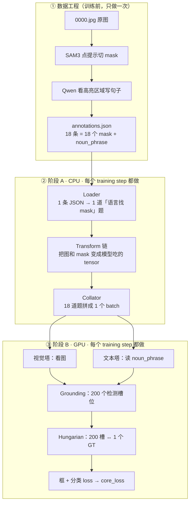
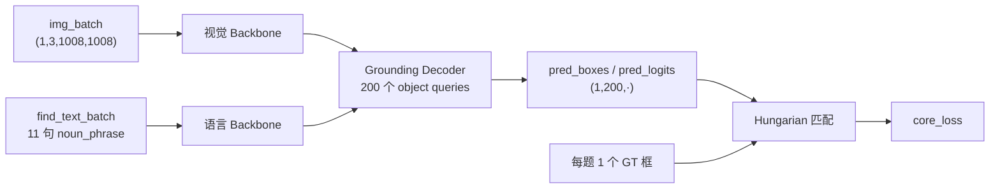

# exp-002 数据流 — 学习版（noun_phrase 微调）

> **写给谁**：已经知道 PyTorch，第一次读 exp-002，觉得 [SFT_DATAFLOW_EXP002.md](SFT_DATAFLOW_EXP002.md) 太像规格书。  
> **读完能做什么**：用一张图（0000.jpg）口述全流程；解释 Transform 链每一步在干什么；说清 exp-002 和 exp-001 差在哪。  
> **规格 / shape 查表**：[SFT_DATAFLOW_EXP002.md](SFT_DATAFLOW_EXP002.md) · **exp-001 入门**：[SFT_DATAFLOW_10MIN.md](SFT_DATAFLOW_10MIN.md)

---

## 第 0 步：一张总流程图（先建立地图）

下面这张图是全文骨架。**先扫一遍，不必记住每个框。**



**三个世界，别混：**

| 世界 | 什么时候 | 干什么 |
|------|----------|--------|
| ① 造数据 | 训练前跑 `generate_t2m_data.py` | SAM 切 mask，Qwen 写 `noun_phrase` |
| ② 阶段 A | 训练时 CPU | 读 JSON → 组 batch |
| ③ 阶段 B | 训练时 GPU | 前向 + loss + 反传 |

exp-002 和 exp-001 **阶段 B 几乎一样**；差别几乎全在 **Loader 怎么组「题目」**。

---

## 第 1 步：用「老师出题」理解 exp-002

拿 `0000.jpg` 当例子。磁盘上有 **18 条 JSON**，每条长这样：

```json
{
  "bbox": [0, 0, 1535, 294],
  "segmentation": [[904, 292, 903, 293, ...]],
  "noun_phrase": "A large blue semi-trailer truck with \"LKW Walter\" branding."
}
```

Loader 把它变成 **18 道单选题**：

| 题号 | 题目（query_text） | 标准答案 |
|------|-------------------|----------|
| 0 | A red SUV parked in front of a blue semi-trailer truck. | 只对应 mask #0 |
| 1 | A yellow puddle on the cracked asphalt surface. | 只对应 mask #1 |
| … | … | … |
| 17 | … | 只对应 mask #17 |

**和 exp-001 对照（只记这一张表）：**

| | exp-001 | **exp-002** |
|--|---------|-------------|
| 每图几道题 | **1 道** | **~20 道**（0000 实测 18） |
| 题目文字 | 固定 `"object"` | **Qwen 写的完整句子** |
| 每题几个答案 | 全图所有 mask（~18 个） | **恰好 1 个 mask** |
| 直觉 | 「把图里所有物体都找出来」 | 「按这句话，找那一个区域」 |

---

## 第 2 步：Transform 链 — 不是 Transformer，是「洗菜流水线」

文档里写的 **Transform 链**，指的是 `Sam3ImageDataset` 取样本时，对 **一张图 + 它的 mask/bbox** 依次做的一串预处理。**和模型里的 Transformer 层无关。**

可以把它想成厨房流水线：**同一张图、同一批 mask，一起经过相同步骤**。

```
原图 4624×2084 + 18 个 polygon mask
        │
        ▼  ① FilterCrowds          去掉 crowd 标注（本项目基本没有）
        ▼  ② RandomizeInputBbox  给输入框加一点随机噪声（本项目纯文本，影响小）
        ▼  ③ DecodeRle            把压缩的 mask 解码成黑白 bitmap
        ▼  ④ RandomResize         随机缩放，长边不超过 1008
        ▼  ⑤ PadToSize            垫成正方形 1008×1008
        ▼  ⑥ ToTensor             PIL/数组 → float tensor
        ▼  ⑦ FilterEmptyTargets   删掉面积≈0 的 mask（可能 18→17）
        ▼  ⑧ Normalize            像素减 0.5 除 0.5，框改成 cxcywh 归一化坐标
        ▼  ⑨ FilterEmptyTargets   再筛一遍空目标
        ▼  ⑩ FilterTooManyOut     单题 GT 太多则删题（exp-002 每题只有 1 个，通常不过滤）
        │
        ▼
img.data          (3, 1008, 1008)   ← 进 GPU 的图
objects[i].segment (1008, 1008)     ← 第 i 个 mask
find_queries[i].query_text          ← 第 i 道题的文字
```

### 逐步用人话解释

| 步骤 | 类名 | 在干什么 | 你可以怎么记 |
|------|------|----------|--------------|
| ③ | `DecodeRle` | JSON 里 mask 先是多边形/RLE，这里变成 **像素级 0/1 图** | 「把 mask 从文件格式变成矩阵」 |
| ④⑤ | `RandomResize` + `PadToSize` | 大图缩到 **1008×1008** 正方形；**mask 和 bbox 同步缩放** | 「图和答案一起缩小、垫边」 |
| ⑥ | `ToTensor` | 图像变 `(3,H,W)` 浮点 tensor | 常规 torchvision 操作 |
| ⑦⑨ | `FilterEmptyTargets` | resize 后有些 mask 缩没了 → **删掉对应题目** | 「太小的目标不要了」 |
| ⑧ | `Normalize` | 像素 `(x-0.5)/0.5`；bbox 变 **中心点+宽高、0~1 归一化** | 「变成模型习惯的数值范围」 |

**配置位置**：[text_nounphrase_train.yaml L21-58](sam3/train/configs/mydata/text_nounphrase_train.yaml#L21)

**代码入口**：Dataset 里对每个 transform 循环调用（[sam3_image_dataset.py L520](sam3/train/data/sam3_image_dataset.py#L520)）：

```python
for transform in self._transforms:
    datapoint = transform(datapoint, epoch=self.curr_epoch)
```

### 易错：两个「Transform」

| 名字 | 是什么 |
|------|--------|
| **Transform 链**（本文） | 数据预处理：`DecodeRle`、`RandomResize`… |
| **Transformer**（模型里） | 视觉/语言/Grounding 里的注意力层，在阶段 B |

---

## 第 3 步：Loader — 唯一和 exp-001 不同的核心代码

**文件**：[coco_json_loaders.py · `COCO_FROM_JSON_NOUN_PHRASE`](sam3/train/data/coco_json_loaders.py#L292)

对 0000.jpg 的 18 条 ann **循环**：

```python
for ann in raw_annotations:
    query_text = ann["noun_phrase"]          # 用 Qwen 句子，不是 "object"
    query["object_ids_output"] = [ann_id]    # 只监督这 1 个 mask
    queries.append(query)
```

输出概念：

```
18 条 find_queries
  query[0]: text="A red SUV ...",  要找 objects[0]
  query[1]: text="A yellow puddle ...", 要找 objects[1]
  ...
```

**yaml 开关**：`use_noun_phrase_loader: true`（[text_nounphrase_train.yaml L220](sam3/train/configs/mydata/text_nounphrase_train.yaml#L220)）

---

## 第 4 步：Collator — 把 18 道题装进一个「书包」

**Collator** = DataLoader 的「打包员」：把 Dataset 返回的 1 个 `Datapoint` 变成模型要的 `BatchedDatapoint`。

0000.jpg 实测（`python scripts/sft_dataflow_trace.py --run --config exp-002`）：

| 字段 | 值 | 人话 |
|------|-----|------|
| `img_batch` | `(1, 3, 1008, 1008)` | 1 张图，所有题共用 |
| find query 数 | **18** | 18 道题 |
| `find_text_batch` | **11 句** | 文本去重后只剩 11 种不同句子 |
| `boxes_padded` | **`(18, 1, 4)`** | 18 行 = 18 题，每行 1 个框 |

**为什么 18 道题但只有 11 句文本？**

Collator 会对相同 `query_text` 去重（[collator.py L215-217](sam3/train/data/collator.py#L215)）。  
多道不同的 mask 可能配了相同或极相似的 Qwen 描述 → 共享同一个 `text_id`，但 **18 道题仍然各自算 loss**。

**shape 怎么记：第一维 = 题目数**

```
exp-001:  boxes_padded (1, 18, 4)   ← 1 题，18 个答案
exp-002:  boxes_padded (18, 1, 4)   ← 18 题，每题 1 个答案
```

---

## 第 5 步：阶段 B — 模型在学什么（和 exp-001 共用同一套）

阶段 B 不需要重学。和 [SFT_DATAFLOW_LEARN.md Day 3-4](SFT_DATAFLOW_LEARN.md) 相同，只强调 exp-002 下的差异：



### 200 个 queries 是什么？

不是 LLM 的 200 个 token。可以想成 **200 个「检测槽位」**：

> 在「A red SUV parked in front of…」这句话的条件下，  
> 每个槽位自问：我要不要认领一个物体？框在哪？

模型从 200 个候选里，用 **Hungarian 匹配** 挑出最像 GT 的那一个，算框 loss。

- **exp-001**：1 道题，200 槽 ↔ **18 个 GT**（多对一认领）
- **exp-002**：18 道题，每题 200 槽 ↔ **1 个 GT**（在 200 里找最像的那一个）

### 实际在优化什么？

| Loss | 作用 |
|------|------|
| `loss_bbox` / `loss_giou` | 预测框 vs GT 框 |
| `loss_ce` / `presence_loss` | 有没有找到目标 |

**注意**：和 exp-001 一样，当前 yaml **没有 mask loss**（`loss_fn_semantic_seg: null`），主要靠框监督。

---

## 第 6 步：串讲模板（关文档后 2 分钟口述）

```
1. 0000.jpg 上有 18 个自动切的 mask，每条配一句 Qwen 描述（noun_phrase）
2. Loader 变成 18 道「按句子找 1 个 mask」的题
3. Transform 链把图缩成 (3,1008,1008)，mask/bbox 同步变换，太小的删掉
4. Collator 打包：1 张图 + 18 题 + 11 句去重文本 + boxes (18,1,4)
5. GPU：视觉塔 + 语言塔 → 200 检测槽 → 每题 Hungarian 对 1 个 GT → loss → 反传
6. 语言塔参数也会更新（lr_language_backbone），所以模型在学「读懂 Qwen 风格句子」
```

---

## 动手验证（建议按顺序跑）

```bash
cd /root/autodl-tmp/sam3

# 只看数据流 A 阶段（不占 GPU 训练）
python scripts/sft_dataflow_trace.py --run --config exp-002

# 分步看
python scripts/sft_dataflow_trace.py --run --config exp-002 --step A2   # Loader
python scripts/sft_dataflow_trace.py --run --config exp-002 --step A3   # Transform 后
python scripts/sft_dataflow_trace.py --run --config exp-002 --step A4   # Collator

# 若要连 GPU 前向 + loss（需显存）
python scripts/sft_dataflow_trace.py --run --config exp-002 --forward
```

**对照输出时只看 4 个数字**：`sample_ann_count=18` → `num_queries=18` → `num_gt_objects=1` → `boxes_padded (18,1,4)`。

---

## 自检题（带答案）

<details>
<summary>1. Transform 链和模型里的 Transformer 是一回事吗？</summary>

不是。Transform 链是 **CPU 数据预处理**（resize、解码 mask…）；Transformer 是 **GPU 模型结构**（注意力层）。
</details>

<details>
<summary>2. 为什么 JSON 有 18 条，训练时 query 可能少于 18？</summary>

`FilterEmptyTargets` 会在 resize 后删掉面积≈0 的 mask，对应题目一起删。
</details>

<details>
<summary>3. exp-002 推理时应该用什么 prompt？</summary>

和训练分布一致的自然语言（可从 JSON 抽 `noun_phrase`，或人工写类似风格的句子）。**不要**只用 `"object"`，那是 exp-001 的训练文本。
</details>

<details>
<summary>4. 若两条 query 文本完全相同，算几道题？</summary>

仍是 **2 道独立题**（2 个 GT mask），只是 Collator 里共享同一个 `text_id`，文本塔只编码一次。
</details>

---

## 推荐阅读顺序

| 你现在的状态 | 读什么 |
|--------------|--------|
| 完全新手 | 先 [SFT_DATAFLOW_10MIN.md](SFT_DATAFLOW_10MIN.md)（exp-001），再本文 |
| 已懂 exp-001，学 exp-002 | **本文** → 需要查 shape 时翻 [SFT_DATAFLOW_EXP002.md](SFT_DATAFLOW_EXP002.md) |
| 要改 Loader / yaml | [coco_json_loaders.py](sam3/train/data/coco_json_loaders.py) + [text_nounphrase_train.yaml](sam3/train/configs/mydata/text_nounphrase_train.yaml) |
| 实验结果 | [records/experiments.md](records/experiments.md) |

---

*文档版本：exp-002 学习版 · 2026-06-11 · shape 实测 sample idx=0*
